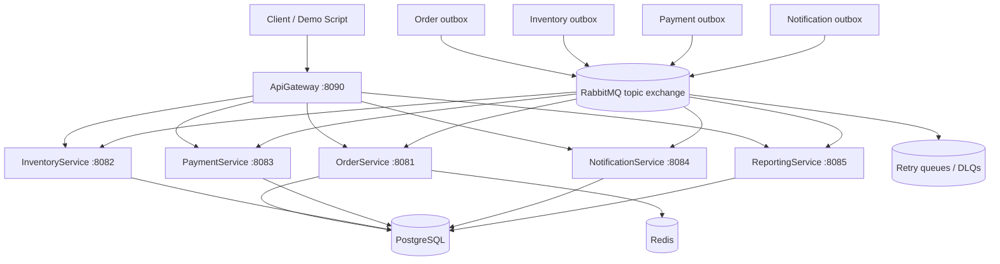

# Event-Driven Order Processing Platform

Production-style ASP.NET Core (.NET 8) backend project that demonstrates an event-driven order workflow with RabbitMQ, PostgreSQL, Redis, Docker Compose, transactional outbox, idempotent consumers, retry/DLQ handling, observability, tests, and an API gateway.

The repository focuses on repeatable local execution, clear service boundaries, and clear documentation. The demo path uses Docker Compose and startup schema initializers for a clean reset. The production-style path uses EF Core migrations.

---

## What this project demonstrates

- ASP.NET Core microservices using .NET 8.
- RabbitMQ topic-exchange messaging.
- PostgreSQL persistence with EF Core.
- Redis cache-aside reads for OrderService.
- Transactional outbox publishing.
- Idempotent consumers with processed-message tables.
- Publisher confirms and unroutable-message detection.
- Bounded retry queues and dead-letter queues.
- Inventory reservation and release.
- Payment success/failure/cancellation safety.
- Duplicate-payment rejection.
- Refund-required compensation marker.
- Notification history service.
- Reporting/read-model projection service.
- API Gateway with lightweight demo authentication.
- Health checks, structured logging, OpenTelemetry basics.
- xUnit, FluentAssertions, Testcontainers,k6 smoke test, and shell/Python operational scripts.
- GitHub files: CI workflow, tool manifest, editor config, Docker, Git ignores, contribution and security notes.

---

## Architecture



More diagrams are in [`docs/architecture-diagrams.md`](docs/architecture-diagrams.md).

---

## Services

| Service | Port | Responsibility | Status |
| --- | ---: | --- | --- |
| ApiGateway | 8090 | Single local entry point, reverse proxy, demo auth, downstream health | Implemented |
| OrderService | 8081 | Create/query/cancel orders, state machine, Redis cache, order outbox, inventory/payment consumers | Implemented |
| InventoryService | 8082 | Product stock, reservation/release, cancellation handling, inventory outbox | Implemented |
| PaymentService | 8083 | Payment simulation, duplicate payment guard, cancellation/payment serialization, refund-required marker | Implemented |
| NotificationService | 8084 | Notification history and simulated send records | Implemented |
| ReportingService | 8085 | Eventually consistent order read model and event audit | Implemented |
| PostgreSQL | 5432 | Shared local database with bounded-context tables | Implemented |
| RabbitMQ | 5672 / 15672 | Topic exchange, retry queues, DLQs, management UI | Implemented |
| Redis | 6379 | Cache-aside reads | Implemented |

---

## Event flow

Happy path:

```text
POST /api/orders
  -> OrderCreated
  -> InventoryReserved
  -> PaymentCompleted
  -> OrderCompleted
  -> NotificationSent
  -> Reporting projection updated
```

Failure and compensation paths:

```text
InventoryReservationFailed -> Order becomes InventoryFailed
PaymentFailed             -> Order becomes PaymentFailed + inventory reservation released
OrderCancelled            -> inventory released; stale payment messages skipped
PaymentRefundRequired     -> emitted when cancellation arrives after completed payment
PaymentDuplicateRejected  -> emitted when the same order receives a second logical payment request
```

---

## RabbitMQ topology

Main exchange: `order-platform.exchange`  
Dead-letter exchange: `order-platform.dlx`

| Routing key | Main consumers |
| --- | --- |
| `order.created` | InventoryService, NotificationService, ReportingService |
| `order.cancelled` | InventoryService, PaymentService, NotificationService, ReportingService |
| `inventory.reserved` | PaymentService, OrderService, ReportingService |
| `inventory.reservation_failed` | OrderService, ReportingService |
| `inventory.released` | ReportingService |
| `payment.completed` | OrderService, NotificationService, ReportingService |
| `payment.failed` | OrderService, InventoryService, NotificationService, ReportingService |
| `payment.refund_required` | NotificationService, ReportingService |
| `payment.duplicate_rejected` | NotificationService, ReportingService |
| `notification.sent` | ReportingService |

Retry queues:

```text
retry.5s.queue
retry.30s.queue
retry.2m.queue
```

DLQs:

```text
inventory.failed.dlq
payment.failed.dlq
notification.failed.dlq
reporting.failed.dlq
```

---

## Payment safety guarantees

The payment workflow is intentionally defensive:

1. Payment and cancellation handling are serialized per order using PostgreSQL transaction-scoped advisory locks.
2. Same-message redelivery is ignored through `payment_processed_messages`.
3. Same-order duplicate payment requests with a different message ID are rejected before a second provider authorization is attempted.
4. Duplicate payment rejection emits `PaymentDuplicateRejected`.
5. If payment already completed and cancellation arrives later, the cancellation is recorded as `RefundRequired` and emits `PaymentRefundRequired`.
6. Notification and Reporting services consume both safety events.

Payment and refund providers are simulated. A real production system would add external provider idempotency keys, refund execution, refund status events, and reconciliation jobs.

---

## Quick start

Start the full platform:

```bash
docker compose -f deploy/docker-compose.yml down -v

docker compose -f deploy/docker-compose.yml up -d --build \
  postgres redis rabbitmq \
  order-service inventory-service payment-service \
  notification-service reporting-service api-gateway
```

Health checks:

```bash
curl -i http://localhost:8090/health
curl -i http://localhost:8081/health
curl -i http://localhost:8082/health
curl -i http://localhost:8083/health
curl -i http://localhost:8084/health
curl -i http://localhost:8085/health
```

RabbitMQ management UI:

```text
http://localhost:15672
username: guest
password: guest
```

---

## Simplest live demo

Run the scripted happy-path demo after the Docker stack is up:

```bash
bash scripts/live-demo.sh
```

The script creates one order through ApiGateway, polls ReportingService until the order reaches `Completed`, and prints the useful URLs/API commands to show in a demo.

Full demo guidance is in [`docs/live-demo.md`](docs/live-demo.md).

---

## Manual API demo

Create an order through the gateway:

```bash
curl -i -X POST http://localhost:8090/api/orders \
  -H "Content-Type: application/json" \
  -H "X-Demo-Api-Key: local-dev-key" \
  -H "X-Correlation-ID: 11111111-1111-1111-1111-111111111111" \
  -d '{
    "customerId": "22222222-2222-2222-2222-222222222222",
    "clientRequestId": "demo-001",
    "currency": "USD",
    "items": [
      {
        "productId": "33333333-3333-3333-3333-333333333333",
        "quantity": 2,
        "unitPrice": 12.34
      }
    ]
  }'
```

Query projections:

```bash
curl -s http://localhost:8090/api/orders/<order-id> | jq
curl -s http://localhost:8090/api/payments/orders/<order-id> | jq
curl -s http://localhost:8090/api/notifications/orders/<order-id> | jq
curl -s http://localhost:8090/api/reports/orders/<order-id> | jq
curl -s http://localhost:8090/api/reports/orders/<order-id>/events | jq
```

Gateway demo auth accepts either:

```text
X-Demo-Api-Key: local-dev-key
Authorization: Bearer local-dev-token
```

---

## Verification commands

The test suite is intentionally split into two lanes. This keeps fast local checks independent from Docker/Testcontainers and live platform checks.

### 1. No-Docker tests

Start with this lane. It does not require Docker, RabbitMQ, PostgreSQL, Redis, or the Docker Compose stack:

```bash
dotnet clean
dotnet restore
dotnet build
bash scripts/test-no-docker.sh --collect:"XPlat Code Coverage"
```

Expected:

```text
Failed: 0
Skipped: 0
```

### 2. Docker-required tests

Start the full platform:

```bash
docker compose -f deploy/docker-compose.yml up -d --build \
  postgres redis rabbitmq \
  order-service inventory-service payment-service \
  notification-service reporting-service api-gateway
```

Then run the Docker lane:

```bash
bash scripts/test-after-docker.sh --collect:"XPlat Code Coverage"
```

The Docker lane runs Testcontainers-backed tests, the live platform smoke test, and DLQ inspection. Expected:

```text
Failed: 0
Skipped: 0
SMOKE TEST PASSED
total_dlq_messages=0
```

For only Testcontainers-backed dotnet tests without live stack checks:

```bash
bash scripts/test-after-docker.sh --dotnet-only --collect:"XPlat Code Coverage"
```

The older all-in-one command remains available, but the two-lane workflow above is recommended:

```bash
bash scripts/test-with-summary.sh --collect:"XPlat Code Coverage"
```

Full details are in [`docs/testing-strategy.md`](docs/testing-strategy.md).

Optional k6 smoke/load sanity check:

```bash
GATEWAY_URL=http://localhost:8090 k6 run tests/k6/order-flow-smoke.js
```

---

## EF Core migrations

Restore the local EF tool:

```bash
dotnet tool restore
```

Generate initial migrations:

```bash
bash scripts/generate-ef-migrations.sh InitialCreate
```

Apply migrations on a clean database:

```bash
docker compose -f deploy/docker-compose.yml down -v
docker compose -f deploy/docker-compose.yml up -d postgres
bash scripts/apply-ef-migrations.sh
```

Important: do not apply `InitialCreate` to a database already initialized by the runtime startup initializers unless the EF migrations history tables are intentionally baselined.

---

## Operational scripts

| Script | Purpose |
| --- | --- |
| `scripts/test-no-docker.sh` | Runs fast no-infrastructure tests. |
| `scripts/test-after-docker.sh` | Runs Docker/Testcontainers tests plus live stack smoke/DLQ checks. |
| `scripts/test-with-summary.sh` | Legacy one-shot all-test runner with a clear pass/fail summary. |
| `scripts/platform-smoke-test.sh` | End-to-end local platform smoke test. |
| `scripts/live-demo.sh` | Short live-demo flow for presentations. |
| `scripts/dlq-inspect.py` | Read-only DLQ inspection through RabbitMQ management API. |
| `scripts/replay-published-events.py` | Idempotent replay of already-published outbox events for projections. |
| `scripts/generate-ef-migrations.sh` | Creates EF migrations for all service DbContexts. |
| `scripts/apply-ef-migrations.sh` | Applies EF migrations for all service DbContexts. |
| `Makefile` | Optional aliases for common validation/demo commands. |

---

## Documentation map

| File | Purpose |
| --- | --- |
| [`docs/testing-strategy.md`](docs/testing-strategy.md) | Two-lane test strategy: no-Docker and Docker-required. |
| [`docs/event-flow.md`](docs/event-flow.md) | Event flow understanding. |
| [`docs/architecture-diagrams.md`](docs/architecture-diagrams.md) | Mermaid architecture and flow diagrams. |
| [`docs/reliability.md`](docs/reliability.md) | Reliability patterns and failure handling. |

---
## Production notes and accepted limitations

This is a production-style local system, not a deployed production environment. The main accepted limitations are:

- Demo auth is intentionally simple; real production should use JWT/OIDC and authorization policies.
- Payment/refund providers are simulated; real production should use provider idempotency keys, refund execution, reconciliation, and webhook verification.
- Startup SQL initializers remain for local demo convenience; production deployment should use EF migrations or a migration-runner job.
- The DLQ tool is read-only by default; a production re-drive tool should republish with confirms and only ACK original messages after successful re-publish.
- Deeper load tests and high-concurrency database tests can be added as future hardening.

