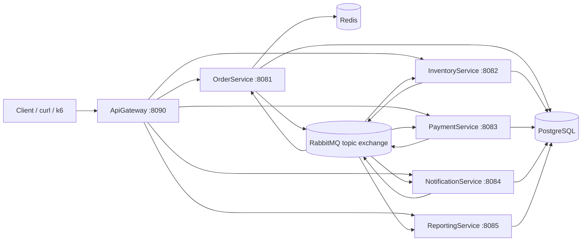
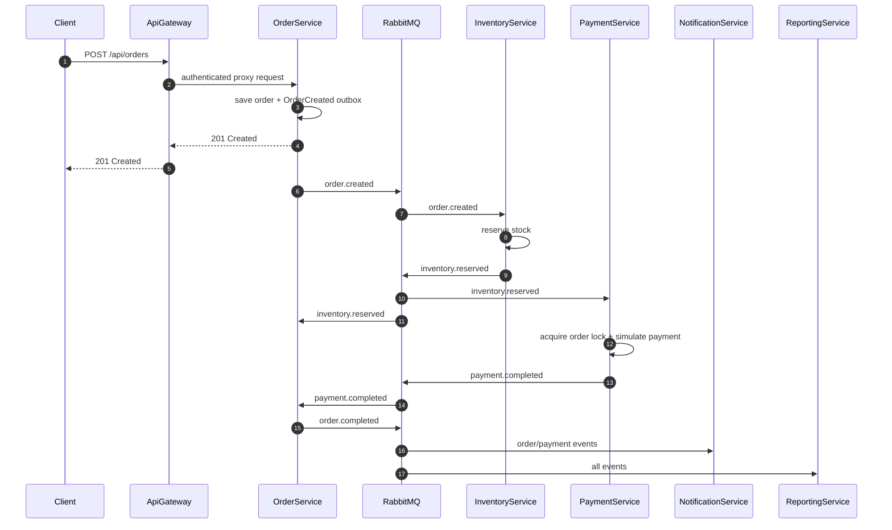
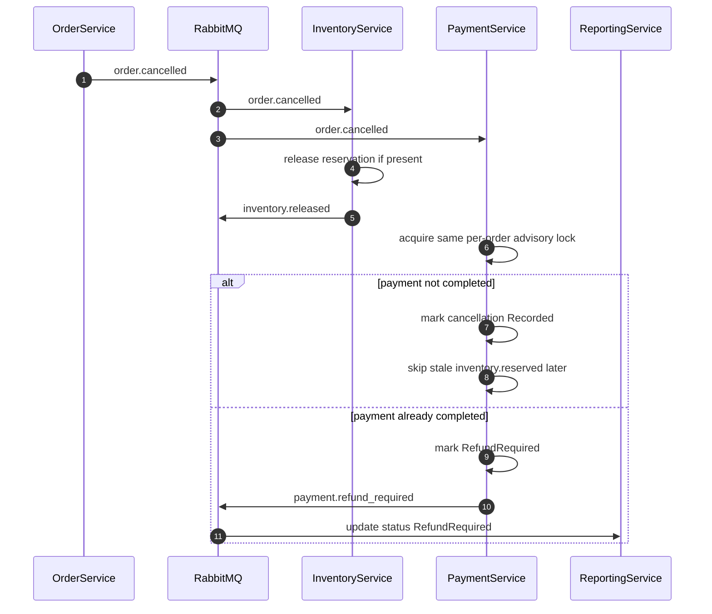
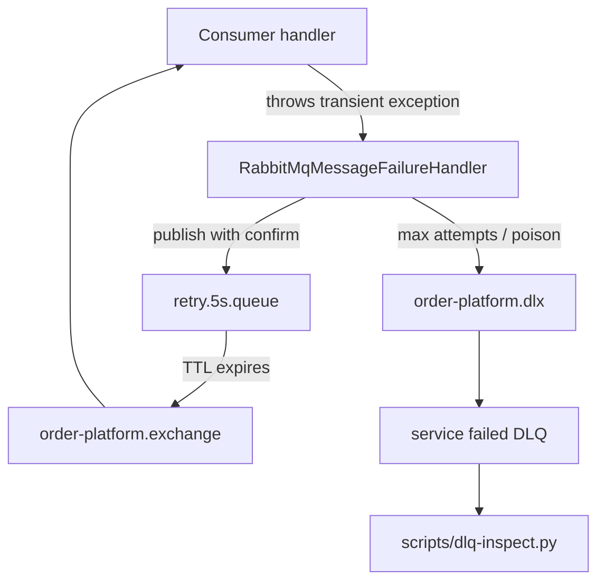

# Architecture Diagrams

## Container view

```mermaid
flowchart LR
    Client[Client / curl / k6] --> Gateway[ApiGateway :8090]
    Gateway --> Order[OrderService :8081]
    Gateway --> Inventory[InventoryService :8082]
    Gateway --> Payment[PaymentService :8083]
    Gateway --> Notification[NotificationService :8084]
    Gateway --> Reporting[ReportingService :8085]

    Order --> Postgres[(PostgreSQL)]
    Inventory --> Postgres
    Payment --> Postgres
    Notification --> Postgres
    Reporting --> Postgres
    Order --> Redis[(Redis)]

    Order --> Rabbit[(RabbitMQ topic exchange)]
    Inventory --> Rabbit
    Payment --> Rabbit
    Notification --> Rabbit
    Rabbit --> Order
    Rabbit --> Inventory
    Rabbit --> Payment
    Rabbit --> Notification
    Rabbit --> Reporting
```

## Happy-path order lifecycle

```mermaid
sequenceDiagram
    autonumber
    participant Client
    participant Gateway as ApiGateway
    participant Order as OrderService
    participant Rabbit as RabbitMQ
    participant Inventory as InventoryService
    participant Payment as PaymentService
    participant Notify as NotificationService
    participant Report as ReportingService

    Client->>Gateway: POST /api/orders
    Gateway->>Order: authenticated proxy request
    Order->>Order: save order + OrderCreated outbox
    Order-->>Gateway: 201 Created
    Gateway-->>Client: 201 Created
    Order->>Rabbit: order.created
    Rabbit->>Inventory: order.created
    Inventory->>Inventory: reserve stock
    Inventory->>Rabbit: inventory.reserved
    Rabbit->>Payment: inventory.reserved
    Rabbit->>Order: inventory.reserved
    Payment->>Payment: acquire order lock + simulate payment
    Payment->>Rabbit: payment.completed
    Rabbit->>Order: payment.completed
    Order->>Rabbit: order.completed
    Rabbit->>Notify: order/payment events
    Rabbit->>Report: all events
```

## Cancellation/payment safety

```mermaid
sequenceDiagram
    autonumber
    participant Order as OrderService
    participant Rabbit as RabbitMQ
    participant Inventory as InventoryService
    participant Payment as PaymentService
    participant Report as ReportingService

    Order->>Rabbit: order.cancelled
    Rabbit->>Inventory: order.cancelled
    Rabbit->>Payment: order.cancelled
    Inventory->>Inventory: release reservation if present
    Inventory->>Rabbit: inventory.released
    Payment->>Payment: acquire same per-order advisory lock
    alt payment not completed
        Payment->>Payment: mark cancellation Recorded
        Payment->>Payment: skip stale inventory.reserved later
    else payment already completed
        Payment->>Payment: mark RefundRequired
        Payment->>Rabbit: payment.refund_required
        Rabbit->>Report: update status RefundRequired
    end
```

## Retry and DLQ flow

```mermaid
flowchart TD
    Consumer[Consumer handler] -->|throws transient exception| RetryHandler[RabbitMqMessageFailureHandler]
    RetryHandler -->|publish with confirm| Retry5[retry.5s.queue]
    Retry5 -->|TTL expires| Exchange[order-platform.exchange]
    Exchange --> Consumer
    RetryHandler -->|max attempts / poison| DLX[order-platform.dlx]
    DLX --> DLQ[service failed DLQ]
    DLQ --> Inspect[scripts/dlq-inspect.py]
```
