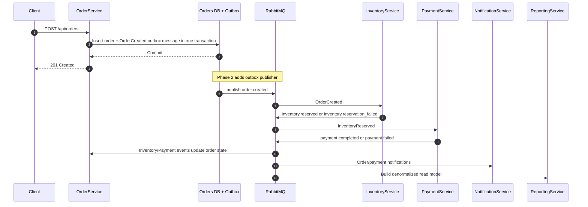

# Event Flow

```mermaid
sequenceDiagram
    autonumber
    participant Client
    participant Orders as OrderService
    participant DB as Orders DB + Outbox
    participant Broker as RabbitMQ
    participant Inventory as InventoryService
    participant Payment as PaymentService
    participant Notify as NotificationService
    participant Reports as ReportingService

    Client->>Orders: POST /api/orders
    Orders->>DB: Insert order + OrderCreated outbox message in one transaction
    DB-->>Orders: Commit
    Orders-->>Client: 201 Created
    Note over DB,Broker: Phase 2 adds outbox publisher
    DB->>Broker: publish order.created
    Broker->>Inventory: OrderCreated
    Inventory->>Broker: inventory.reserved or inventory.reservation_failed
    Broker->>Payment: InventoryReserved
    Payment->>Broker: payment.completed or payment.failed
    Broker->>Orders: Inventory/Payment events update order state
    Broker->>Notify: Order/payment notifications
    Broker->>Reports: Build denormalized read model
```
